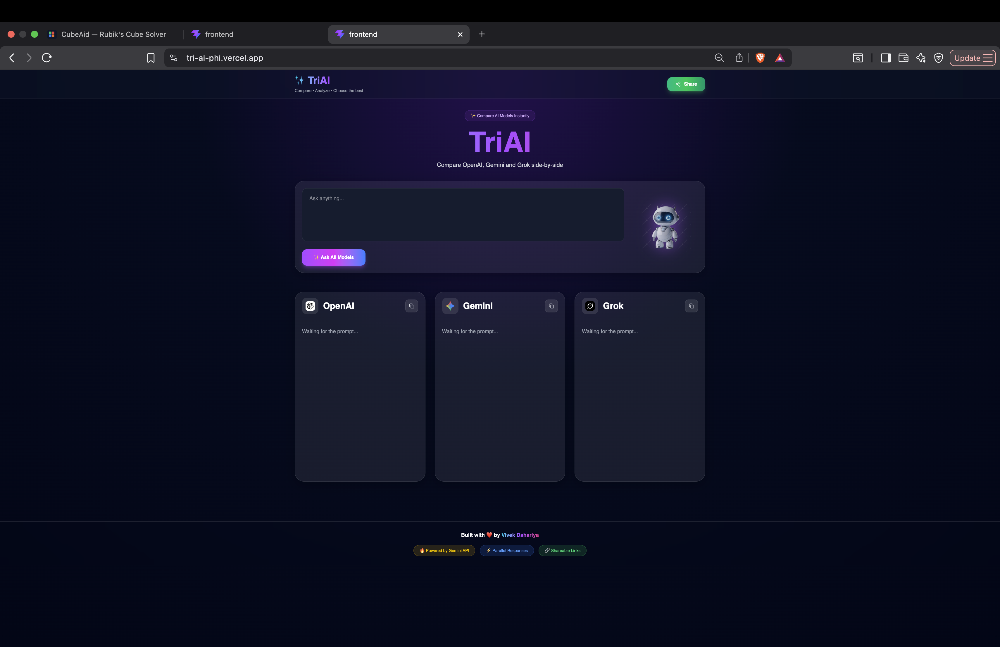
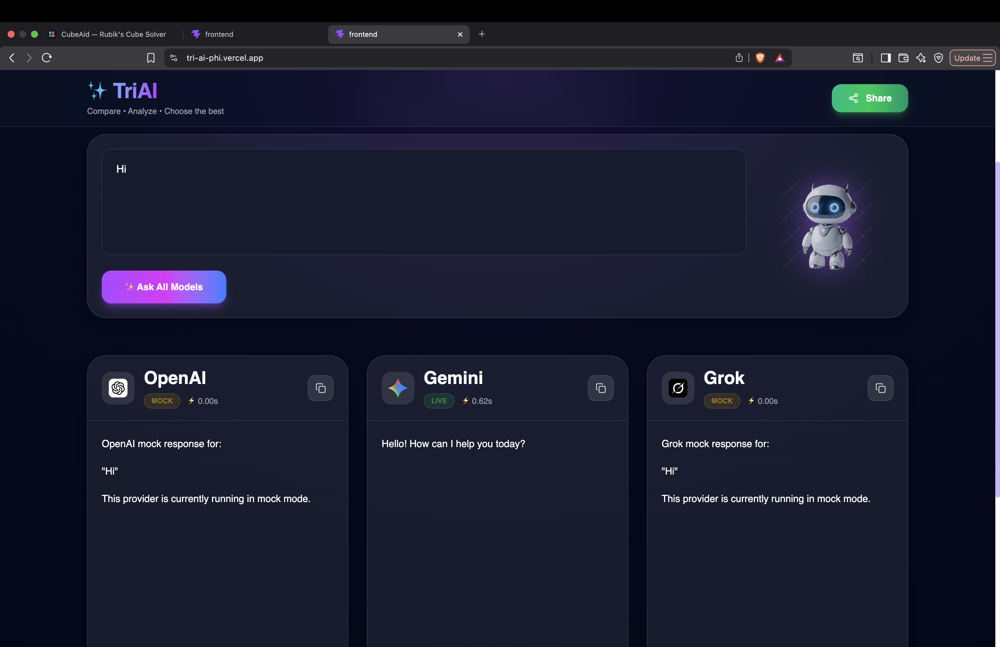
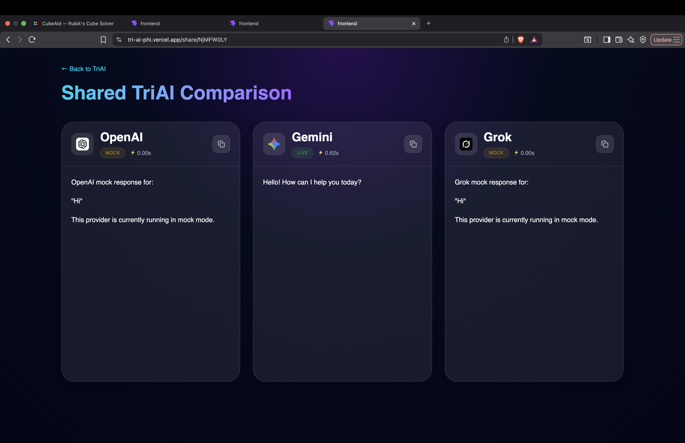

# ✨ TriAI

<p align="center">
  
</p>

<h3 align="center">
Compare AI Models Side-by-Side. Analyze Responses, Speed & Behavior.
</h3>

<p align="center">
A desktop-first AI comparison platform that allows users to compare multiple AI models in a single beautiful interface.
</p>


---

## 🌐 Live Demo

Frontend:
https://tri-ai-phi.vercel.app

Backend API:
https://triai-backend.onrender.com


---

# 📸 Screenshots


## Landing Page




---

## AI Comparison Result




---

## Shareable Comparison Page




---

# 🚀 Problem Statement

Modern AI users frequently switch between different AI platforms to compare answers, reasoning styles, response quality, and speed.

This process is inefficient because each model exists on separate websites.

**TriAI solves this problem by providing one unified platform where multiple AI models can be compared side-by-side in real time.**


---

# ✨ Features


## Implemented Features

- ✅ Real Gemini API integration
- ✅ Parallel AI response architecture using `Promise.all()`
- ✅ OpenAI mock provider
- ✅ Grok mock provider
- ✅ Response latency measurement
- ✅ Live / Mock / Error status indicators
- ✅ Markdown response rendering
- ✅ Individual response copy functionality
- ✅ Shareable comparison links
- ✅ Glassmorphism-inspired modern desktop UI
- ✅ Real AI provider branding
- ✅ Loading states and animations
- ✅ Production deployment with Vercel & Render
- ✅ Secure environment variable handling


---

# 🏗️ System Architecture


```
                           User
                             |
                             |
                      React + Vite
                       Frontend UI
                             |
                             |
                      REST API Calls
                             |
                             |
                    Express.js Backend
                             |
          ---------------------------------
          |               |               |
       OpenAI          Gemini            Grok
        Mock          Live API           Mock
```

---

# 🧠 How TriAI Works


1. User enters a prompt.

2. Frontend sends a request to the Express backend.

3. Backend triggers all AI providers simultaneously using:

```javascript
Promise.all()
```

4. The response time of each model is measured.

5. Responses are standardized into a common JSON structure.

6. Frontend displays every AI response inside independent comparison cards.


---

# 🛠️ Tech Stack


## Frontend

- React.js
- Vite
- Tailwind CSS
- React Router
- React Markdown
- Lucide React


## Backend

- Node.js
- Express.js
- CORS
- NanoID


## AI Integration

- Google Gemini API (Live)
- OpenAI (Mock Provider)
- Grok (Mock Provider)


## Deployment

- Vercel (Frontend)
- Render (Backend)
- GitHub (Version Control)


---

# 📂 Project Structure


```

TriAI
│
├── frontend
│   │
│   ├── src
│   │   ├── components
│   │   ├── pages
│   │   ├── assets
│   │   └── App.jsx
│   │
│   └── package.json
│
├── backend
│   │
│   ├── src
│   │   ├── providers
│   │   │
│   │   ├── gemini.js
│   │   ├── openaiMock.js
│   │   └── grokMock.js
│   │
│   └── server.js
│
└── README.md


```

---

# 🔗 Sharing System


TriAI allows users to generate shareable links for AI comparisons.

Current implementation uses an in-memory JavaScript `Map()` for storing shared comparisons.

This provides a fast MVP implementation but shared links are not permanently stored.

---

# ⚠️ Current Limitations


### OpenAI & Grok

OpenAI and Grok currently use mock providers because official API usage requires paid access.


### Share Persistence

Share data is stored temporarily in server memory.

When the Render free server restarts, old share links are removed.


### Mobile Experience

TriAI is intentionally optimized for desktop usage and is not yet fully responsive.


---

# 🔮 Future Improvements


- Add real OpenAI API integration
- Add real Grok API integration
- Integrate a database (MongoDB / PostgreSQL) for permanent shared links
- Add user authentication
- Save chat history
- Add more AI providers such as Claude, DeepSeek and Llama
- Add streaming responses
- Add AI model settings
- Improve mobile responsiveness


---

# ⚙️ Local Development Setup


## Clone Repository


```bash
git clone https://github.com/VivekDahariya/TriAI.git
```


## Frontend Setup


```bash
cd frontend

npm install

npm run dev
```


## Backend Setup


```bash
cd backend

npm install

npm run dev
```


Create a `.env` file inside backend:

```
GEMINI_API_KEY=your_api_key_here
```

---

# 📈 Development Journey

TriAI was developed as a complete full-stack project involving:

- UI/UX design and iteration
- React component architecture
- API integration
- Backend development
- Response optimization
- Error handling
- Deployment on cloud platforms
- GitHub version control


---

# 👨‍💻 Author


**Vivek Dahariya**

Built with ❤️ using React, Node.js and AI.


GitHub:
https://github.com/VivekDahariya


---

# ⭐ If you liked this project, consider giving it a star!
